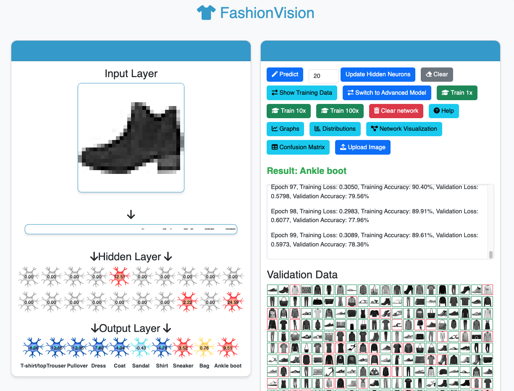
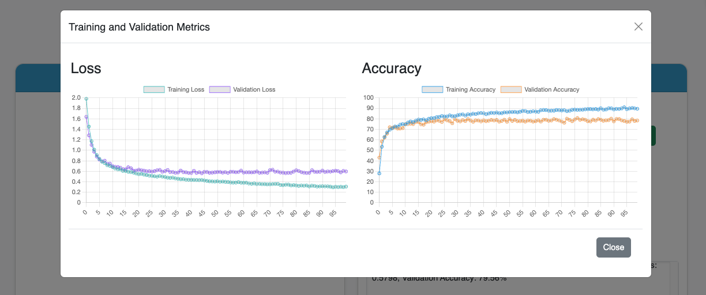

# FashionVision

FashionVision is a Flask web application built on PyTorch that allows users to interactively train and visualize a neural network for recognizing fashion items. The app provides an intuitive interface for uploading or drawing fashion items, training the model, and visualizing various aspects of the neural network and its performance.

## Features

- **Interactive Digit Drawing:** Draw digits on a grid to test the neural network's predictions.
- **Real-Time Training:** Train the neural network on the Fashion-MNIST dataset and visualize training progress in real-time.
- **Metrics Visualization:** View training and validation loss and accuracy in a popup graph.
- **Model Management:** Save and load trained models for later use.
- **Hyperparameter Tuning:** Adjust training parameters like learning rate and batch size through the UI.
- **Confusion Matrix:** Visualize the model's performance using a confusion matrix.

## Screenshots


*Description: The main interface where users can draw digits and interact with the neural network.*


*Description: Popup window displaying training and validation metrics.*

## Getting Started

Follow these instructions to set up and run the application using Docker.

### Prerequisites

Ensure you have the following installed:
- Docker
- Docker Compose

### Installation

1. **Clone the repository:**
   ```bash
   git clone https://github.com/dkruyt/fashionvision.git
   cd fashionvision
   ```

2. **Build and run the application using Docker Compose:**
   ```bash
   docker-compose up --build
   ```

   This will build the Docker image and start the application. The app will be available at `http://localhost:8000`.

### Usage

1. **Open your browser and navigate to:**
   ```
   http://localhost:8000
   ```

2. **Interact with the App:**
   - Use the input grid to draw a digit.
   - Click the "Predict" button to see the neural network's prediction.
   - Load training data and start training the model using the provided buttons.
   - View training and validation metrics by clicking the "Graphs" button.

### File Structure

```
digitvision/
│
├── Dockerfile                # Dockerfile for building the Docker image
├── docker-compose.yaml       # Docker Compose configuration
├── entrypoint.sh             # Entrypoint script for Docker container
├── requirements.txt          # Python dependencies
├── server.py                 # Flask server and neural network training logic
├── static/
│   └── index.js              # JavaScript for client-side functionality
└── templates/
    └── index.html            # Main HTML file
```

### Docker Configuration

The `docker-compose.yaml` file is configured to build and run the application with the following default environment variables:

- `HIDDEN_NEURONS`: Number of neurons in the hidden layer (default: 8)
- `LIMIT_PER_DIGIT`: Number of digits per class for training (default: 16)
- `NUM_CLASSES`: Number of output neurons and number of digit classes (default: 10)

These values can be adjusted by editing the `docker-compose.yaml` file.

### Contributing

Contributions are welcome! Please follow these steps:
1. Fork the repository.
2. Create a new branch (`git checkout -b feature-branch`).
3. Make your changes.
4. Commit your changes (`git commit -am 'Add new feature'`).
5. Push to the branch (`git push origin feature-branch`).
6. Create a new Pull Request.

### License

This project is licensed under the GPLv3 License - see the [LICENSE](LICENSE) file for details.

### Acknowledgments

- The Fashion-MNIST dataset used in this app is provided by Zalando Research.
- Thanks to the open-source community for providing the tools and libraries that made this project possible.
- Sparky, for his BackPropagation app, which inspired this application.

---

Happy training with FashionVision!